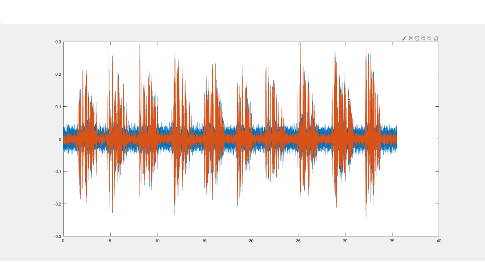
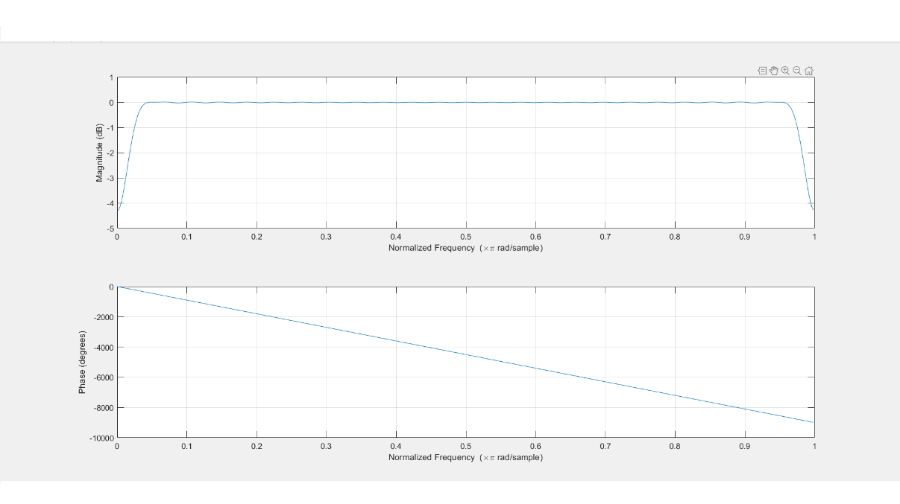
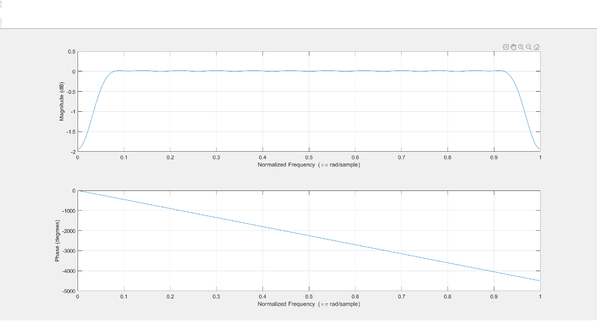
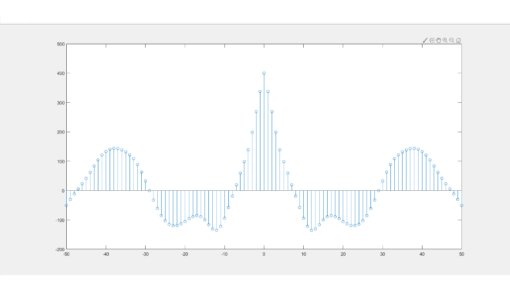
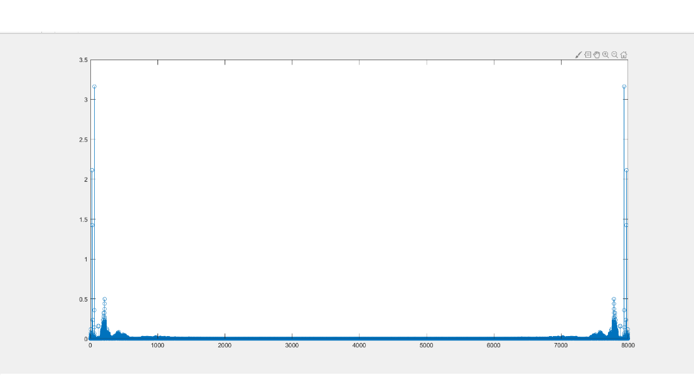
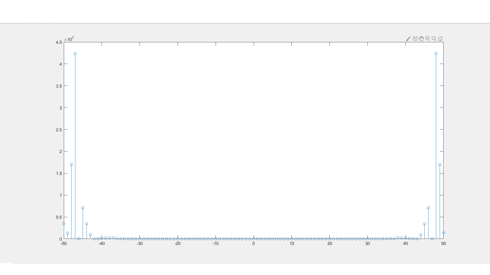

# LMS Adaptive Filter – Unified Project

## Overview
This project implements an adaptive FIR filter using the LMS algorithm. Below are some example plots generated from the included MATLAB analysis scripts.


This repository combines two related coursework projects into a single, consistent layout:
- **C implementation** (time-domain LMS, two targets): synthetic testbench and from-files runner.
- **MATLAB notebooks/scripts** for analysis, LMS demos, and optional FFT-based comparison.
- Shared `data/` and `results/` directories, with reproducible paths.

## Structure
```
.
├── c_lms/                             # C sources + Makefile (two executables)
├── matlab/
│   ├── freq_time_domain_audio/       # Coursework MATLAB scripts (xcorr, LMS demo, plots)
│   └── helpers/                      # wav_to_txt.m, results_plots.m, fft_compare.m
├── data/                             # Input data (WAV, TXT)
├── results/                          # Generated outputs 
├── report/                           # Coursework reports (PDF/DOCX)
├── references/                       # Reference PDFs
└── .github/workflows/ci.yml
```

## Build the C programs
```bash
make -C c_lms
```

## Run (synthetic)
```bash
./c_lms/bin/lms_synthetic --order 21 --beta 0.01 --nsamples 2000 --out results/
```

## Run (from files)
```bash
# expects data/speechnoise.txt and data/desired.txt (1 column each)
./c_lms/bin/lms_from_files --order 21 --beta 0.01   --input data/speechnoise.txt --desired data/desired.txt --out results/
```

## MATLAB helpers
- Convert a WAV to text:
  ```matlab
  wav_to_txt('data/OSR_us_000_0017_8k.wav','data/speechnoise.txt')
  ```
- Plot outputs after a run:
  ```matlab
  results_plots
  ```
- Optional spectrum comparison (Fourier as analysis, not in the LMS loop):
  ```matlab
  fft_compare('results/ERROR.txt','results/Y_OUT.txt', 8000)
  ```

---

## Example Figures
The following plots were generated by the author during coursework using MATLAB and are included for demonstration purposes:







